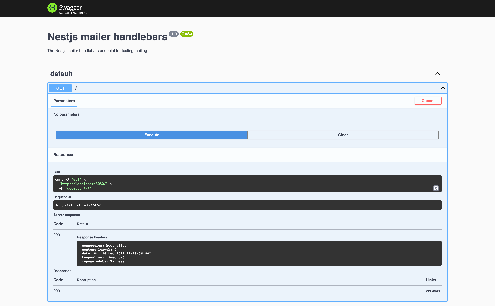
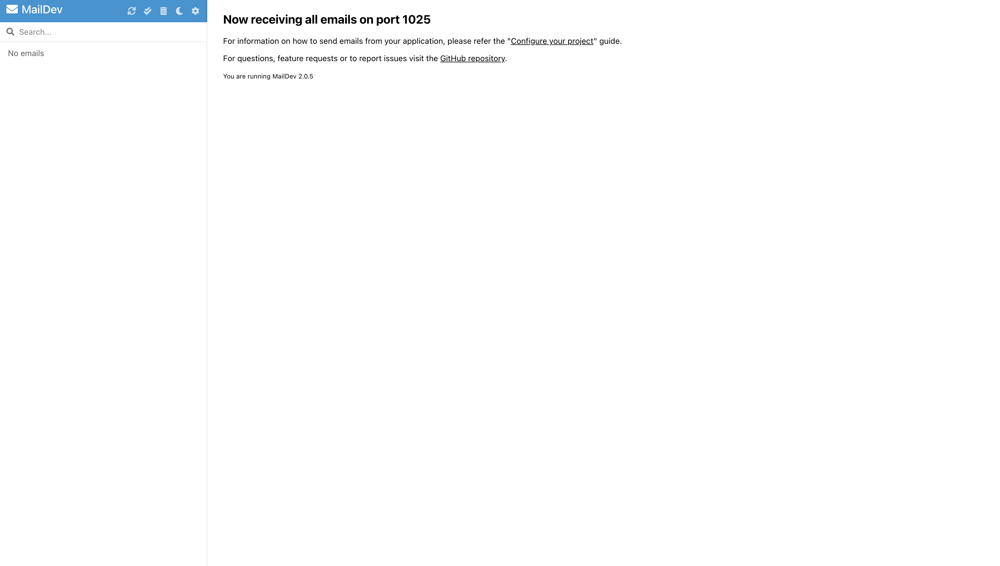
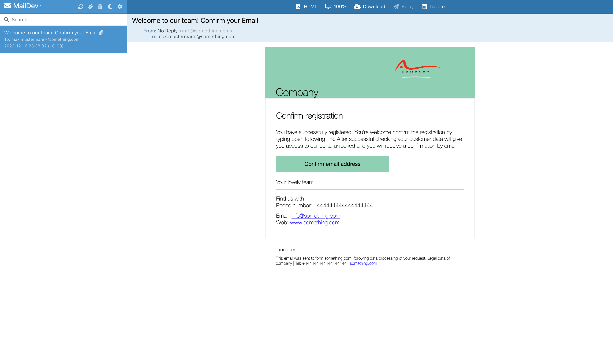

# Nestjs Mailer Handlebars

## Description

Project which integrates [nestjs.com](https://nestjs.com), [nest-modules/mailer/](https://nest-modules.github.io/mailer/) 
and [handlebars](https://handlebarsjs.com)

## Running the app

This project is build with Docker and docker compose, and to run the app execute the following command.

```bash
docker compose up

# or

docker compose up -d
```

After that open the OpenAPI url: ``http://localhost:3000/api``



where you can see the api which this project contains.

If you open in parallell also the url for checking emails: ``http://localhost:1080``, you will see empty list:



To do a test, go again to OpenAPI and try the endpoint, immediately you will see email in the maildev, formatted as below:



## Test

```bash
# unit tests
npm run test
```

## License

Nest is [BSD 3-Clause License](LICENSE).
